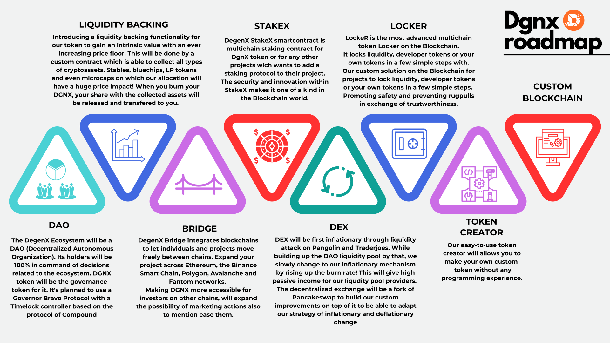

# Roadmap

## ✔️ DAO

The DegenX Ecosystem will be a DAO (Decentralized Autonomous Organization). Its holders will be 100% in command of decisions related to the ecosystem. DGNX token will be the governance token for it. It's planned to use a Governor Bravo Protocol with a Timelock controller based on the protocol of Compound (https://docs.compound.finance/v2/governance/).

## 🚧 Liquidity Backing

Introducing a liquidity backing functionality for our token to gain an intrinsic value with an ever increasing price floor. This will be done by a custom contract which is able to collect all types of cryptoassets. Stables, bluechips, LP tokens and even microcaps on which our allocation will have a huge price impact! When you burn your dgnx, your share with the collected assets will be released and transfered to you. This will have no effect on the backing of other owners, instead it will grow faster for them since their percentage allocation of the maximum supply is now higher.

## 🔲 Bridge

DegenX Bridge integrates blockchains to let individuals and projects move freely between chains. Expand your project across Ethereum, the Binance Smart Chain, Polygon, Avalanche and Fantom networks.
Making DGNX more accessible for investors on other chains, will expand the possibility of marketing actions also to mention ease them.

## 🔲 R.U.G (Really Unbelievable Gains, Staking)

Our multichain staking system starting with DGNX but available for any other token which wants to introduce secure, cutting-edge utility to their projects.

## 🔲 DEX

DEX will be first inflationary through liquidity attack on Pangolin and Traderjoes. While building up the DAO liquidity pool by that, we slowly change to our inflationary mechanism by rising up the burn rate! This will give high passive income for our liqudity pool providers.
The decentralized exchange will be a fork of Pancakeswap to build our custom improvements on top of it to be able to adapt our strategy of inflationary and deflationary change.

## 🔲 D.U.M.P (Degen Ultimate Money Printer, Locker)

Our custom solution on the Blockchain for projects to lock liquidity, developer tokens or your own tokens in a few simple steps. Promoting safety and preventing rugpulls in exchange of trustworthiness.

## 🔲 Token Creator

work in progress

## 🔲 Chain

work in progress
